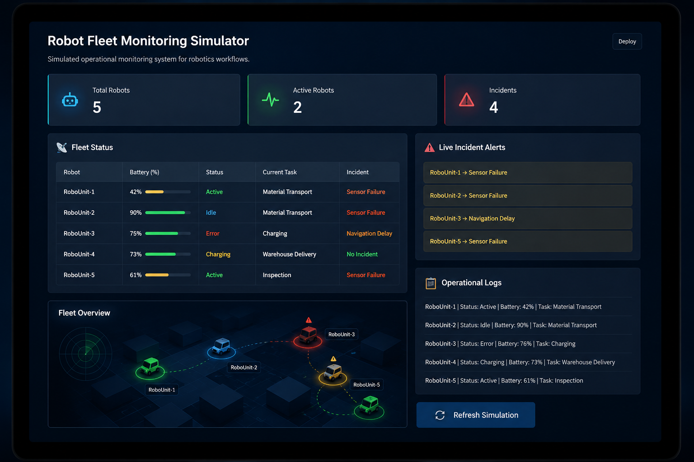

# Robot Fleet Monitoring Simulator

A Python-based simulation dashboard for monitoring robotic fleet operations, workflow states, battery levels, and operational incidents.

The project explores robotics workflow monitoring, operational visibility, and simulation-based testing systems through an interactive dashboard interface.

<div align="center">

  

  <br/>
  <br/>

  <p>
    Robot Fleet Monitoring Simulator — Operational dashboard for monitoring robotic workflows, incidents, and fleet activity.
  </p>

</div>

## Tech Stack

- Python
- Streamlit
- Pandas

## Features

- Robot fleet monitoring
- Operational status tracking
- Battery monitoring
- Incident simulation
- Workflow visualization
- Operational logs
- Interactive simulation refresh

## Running the Project

Install dependencies:

```bash
pip install -r requirements.txt
```

Run the simulator:

```bash
streamlit run app.py
```

## Project Structure

```text
robot-fleet-monitoring-simulator/
│
├── app.py
├── requirements.txt
└── README.md
```

## Future Improvements

- Real-time robot simulation
- Robot path visualization
- AI-assisted incident analysis
- Multi-agent workflow simulation
- ROS integration

## Author

Shanmukh Venkat Sai Kumar Pilla

M.Sc. Engineering of Socio-Technical Systems  
University of Oldenburg
